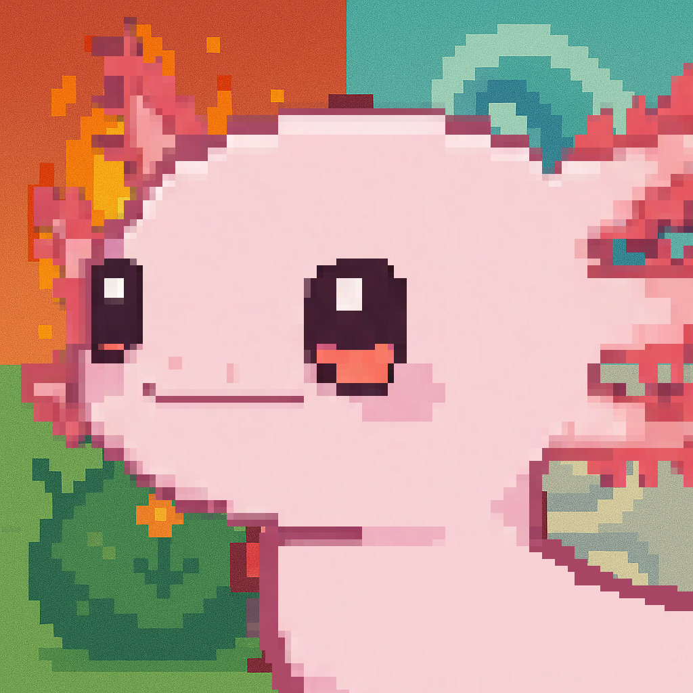
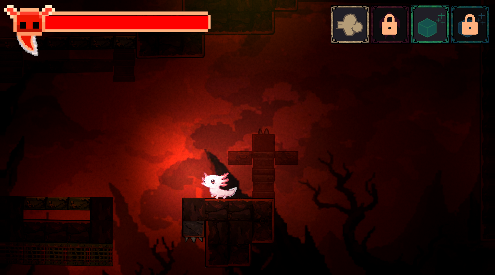
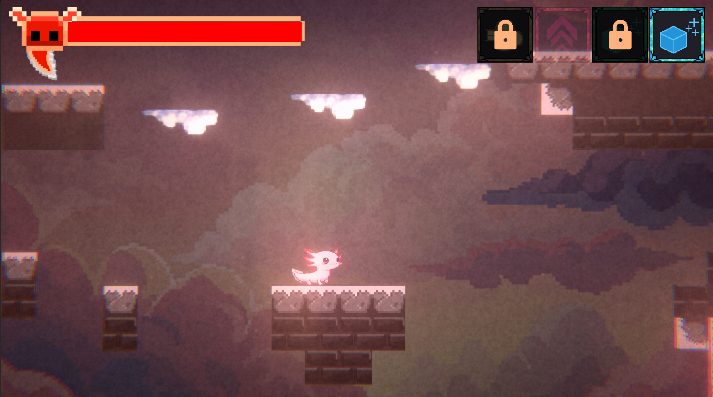
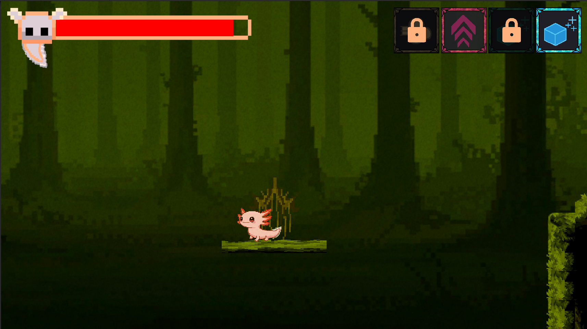
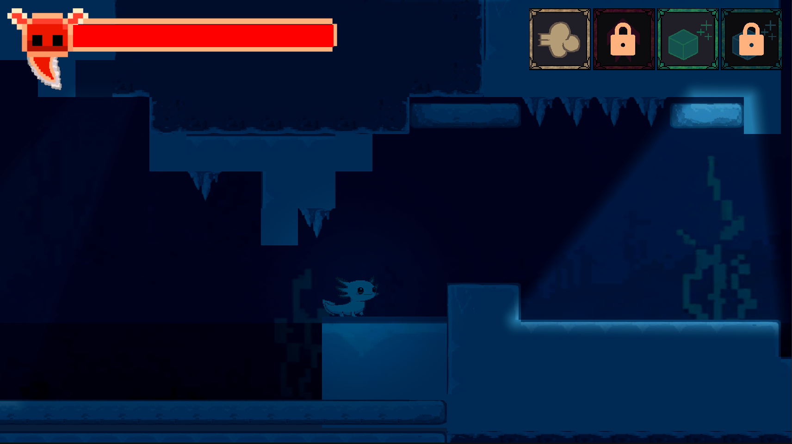

# Axoramentum - Game Design Overview

## 🎮 Game Overview

**Axoramentum** is a 2D pixel-art platformer that follows an axolotl chosen by the gods to restore balance to a world fractured by chaos. The game is built around four core elements—**Fire, Water, Earth, and Air**—and challenges the player to master each in their respective biomes to reach the **Elemental Temple**.

## 🌍 World & Setting

The world is divided into four elemental biomes:

- 🔥 **Fire Biome**
- 💧 **Water Biome**
- 🌱 **Earth Biome**
- 🌪️ **Air Biome**

Each biome has unique physics properties:

- Fire & Water: time distortion, faster-paced gameplay
- Earth & Air: gravity manipulation, floaty or heavy movement

## ⚙️ Core Gameplay Mechanics

- **Element-Limited Abilities:**  
  Elements can only be used in opposite biomes (e.g. Fire abilities only work in Earth or Air biomes).
- **Element Abilities:**

  - Fire → Double Jump
  - Water → Ice Platform Creation
  - Earth → Temporary Ground Platform
  - Air → Quick Dash

- **Health-Based Ability Cost:**  
  Using an elemental ability reduces the player's health, encouraging strategic use and timing.

- **Time & Gravity Distortion:**  
  Biomes not only change visuals and level layout but also bend time and gravity, creating dynamic platforming challenges.

## 🧩 Strategy & Progression

Players must carefully choose when and where to use elemental abilities due to their health cost and biome restrictions. Exploration, reflexes, and environmental awareness are key to success.

## 🔧 Features To Be Developed

- Smoother biome transitions
- Additional visual effects & feedback
- Interactive traps and environmental puzzles
- Hostile and friendly NPCs/creatures
- Expanded level variety and secret paths

## 📷 Gallery

_Add your game screenshots or concept art here._

## 🧠 Inspirations

- Greek philosopher **Empedocles’ theory of four elements**
- Classic Metroidvania platformers
- Element-based puzzle mechanics

## ✅ Project Highlights

- Unique use of health as a resource for abilities
- Dynamic biomes with custom physics
- Rich pixel-art visuals and distinct elemental aesthetics
- Strategic element-based platforming

---
